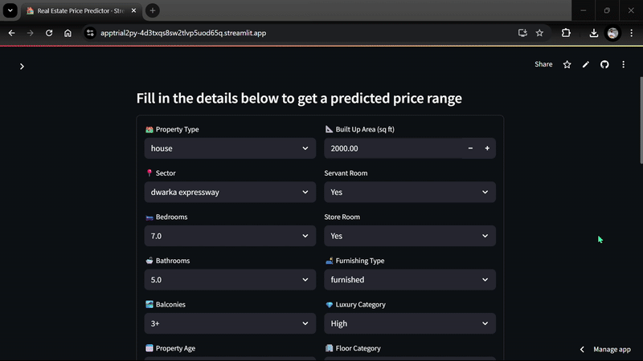

# 🏠 House Price Prediction - ML Project

[](https://apptrial2py-4d3txqs8sw2tlvp5uod65q.streamlit.app/)

A machine learning project that predicts house prices based on user input features like number of bedrooms, bathrooms, area, etc. The app is built using Python and Streamlit and is trained on a cleaned dataset using scikit-learn models.

---

## 🚀 Live Demo

👉 [Click here to try the deployed app](https://apptrial2py-4d3txqs8sw2tlvp5uod65q.streamlit.app/)

 <!-- Replace this with your actual GIF -->

---

## 🧠 Features

- Data Cleaning and Preprocessing
- Model Training using Regression Algorithms
- Real-time Web App Interface with Streamlit
- Interactive form for input and prediction

---

## 🛠️ Tech Stack

- Python
- Pandas, NumPy
- Scikit-learn
- Streamlit

---

## 📁 Current Project Structure
```text
├── app.py # Streamlit app script
├── pipeline.pkl # Trained model pipeline
├── home.html # Static HTML (if used)
├── preprocess.py # Custom preprocessing script
├── Procfile # For deployment (Heroku/Streamlit)
├── requirements.txt # List of dependencies
├── README.md # This file
```


---

## ⚙️ How to Run This Project Locally

```bash
# Step 1: Clone the repo
git clone https://github.com/gourab-9/house-price-prediction-mlproject-.git
cd house-price-prediction-mlproject-

# Step 2: Install dependencies
pip install -r requirements.txt

# Step 3: Run the Streamlit app
streamlit run app.py
```

📜 License
This project is licensed under the MIT License. See the LICENSE file for details.


👨‍💻 Author
Gourab Kumar
🔗 LinkedIn -- https://www.linkedin.com/in/gourab-kumar/
📧 your-gourabsingh09@gmail.com
